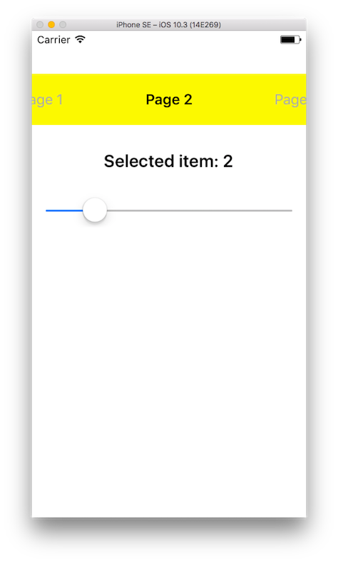
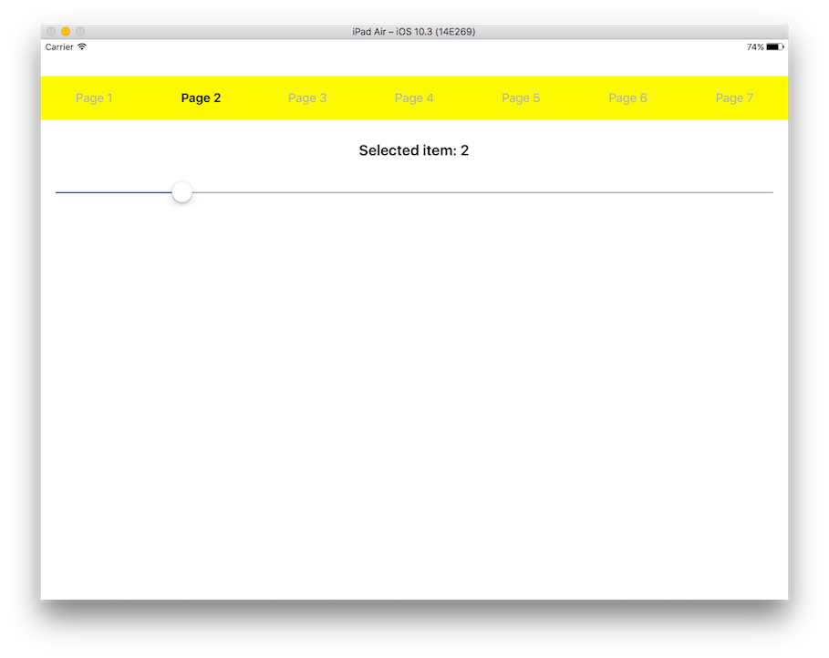

# MBPickerView

This is **horizontal picker view** similar to native iOS UIPickerPicker with a lot of customisation. It has advance delegates to manage all event of MBPickerView. You can also pass custom **UIView** to the picker.



## Installation

### CocoaPods

[CocoaPods](http://cocoapods.org) is a dependency manager for Cocoa projects. You can install it with the following command:

```bash
$ gem install cocoapods
```

To integrate ***MBPickerView*** into your Xcode project using CocoaPods, specify it in your `Podfile`:

```ruby
target '<Your Target Name>' do
    pod 'MBPickerView'
end
```

Then, run the following command:

```bash
$ pod install
```

##How to Use

It is very simple and easy to use. It is having similar **delegate** and **dataSource** as UIPickerView. To know more please see [MBPickerViewDelegate](Source/MBPickerView.swift) and [MBPickerViewDataSource](Source/MBPickerView.swift).

### Customization
You can customize Picker view title (title Color and Font) **[PickerTitleAttributes](Source/MBPickerView.swift)** for selected and deselected state by setting **[MBPickerViewTitleAttribute](Source/MBPickerView.swift)** to picker view. You can also adjust title padding scaling [titlePaddingScale](Source/MBPickerView.swift) (overlapping of next and previous item).

##Licence

**[MIT](LICENSE)**
